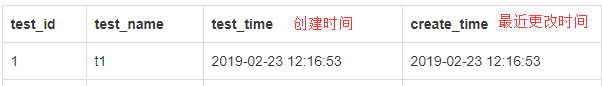
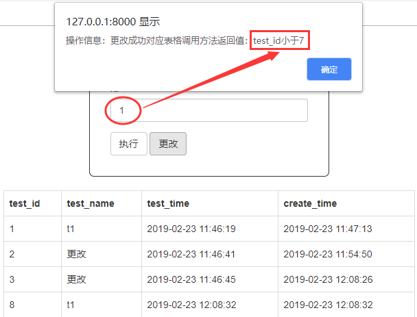

# Django_model_example
This is an example of django_model

Contains methods： 
  &nbsp;&nbsp; **Use of "DateTimeField"  attention:auto_now_add/auto_now** 
  &nbsp;&nbsp; **Use of "models.Manager"** 
  
  DateTimeField-img:
  
  
  
  
  models.Manager-img:
  
  
  
  
